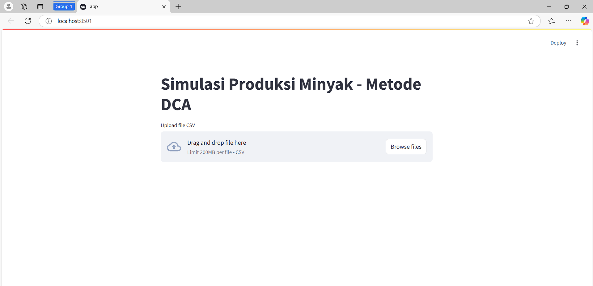
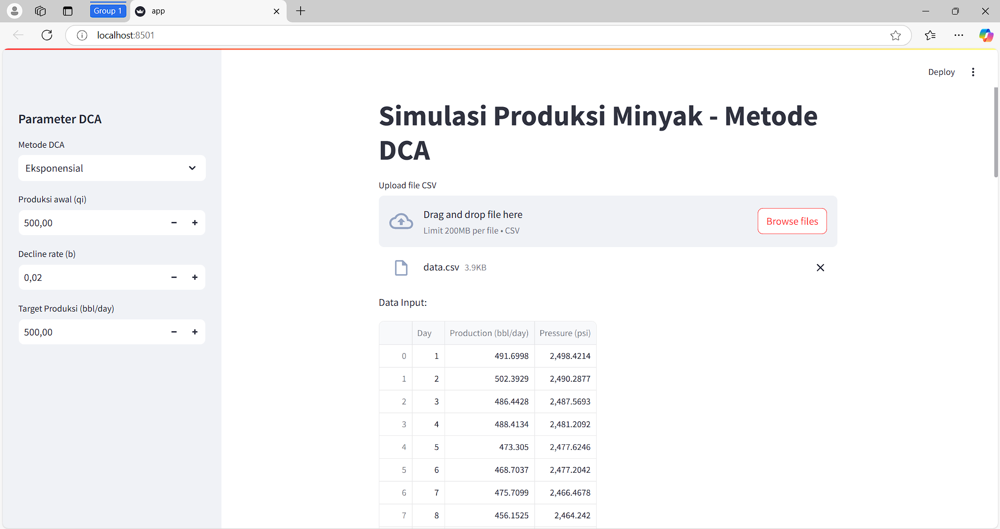
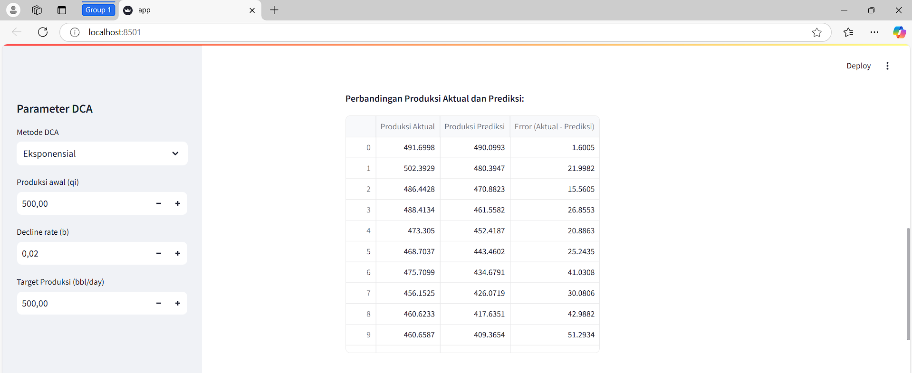
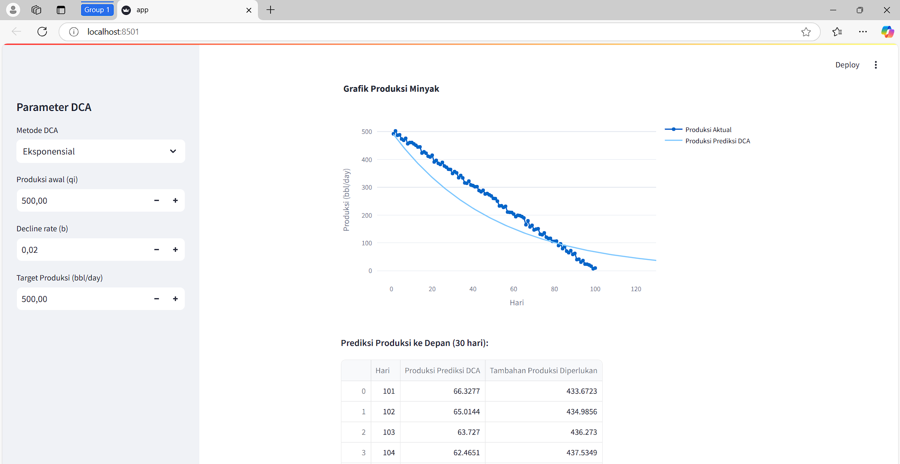
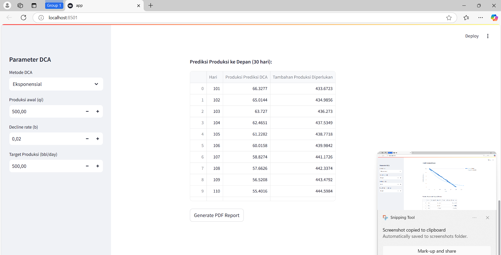

# Simulasi Prediksi Produksi Minyak Berbasis Web - Metode DCA
Proyek ini adalah aplikasi prediksi produksi minyak berbasis website menggunakan python dan streamlit sebagai tampilan. Aplikasi ini dapat memvisualisasikan data produksi minyak harian dan memberikan analisis berdasarkan data yang tersedia.

## Hasil Gambar
Berikut adalah contoh tampilan aplikasi:
### Tampilan Upload File data

### Tampilan data

### Tampilan Perbandingan Data

### Tampilan Grafik

### Tampilan Prediksi Produksi ke depan

## Fitur
- Menampilkan grafik produksi minyak harian
- memvisualisasikan tekanan reservoir terkait produksi
- laporan pdf

## Cara Menggunakan
Ikuti langkah-langkah berikut utk menjalankan Aplikasi:
1. **Clone Repository**
   git clone https://github.com/egikarnia/simulasiPrediksiProduksiOil.git
2. **Install Library/Pustaka* 
   pip install -r requirements.txt
3. Jalankan Aplikasi:
   py -m streamlit run app.py
   atau
   streamlit run app.py
   
